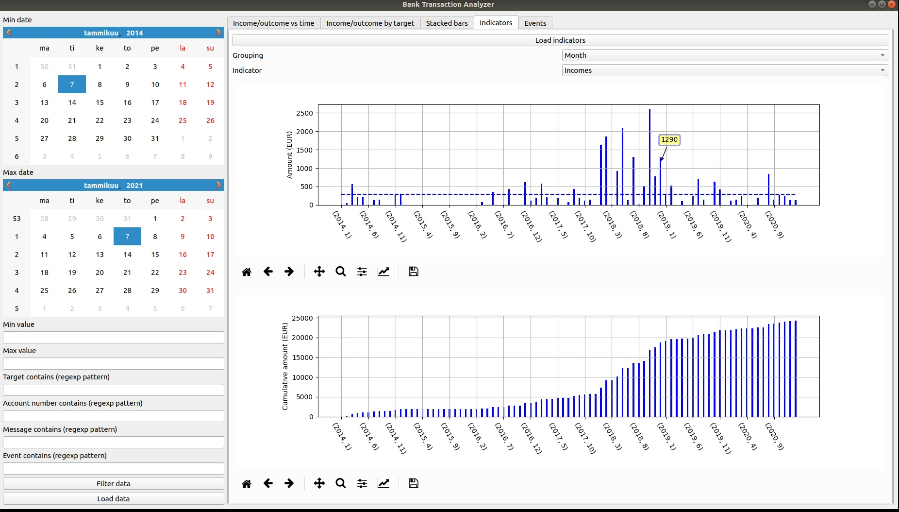
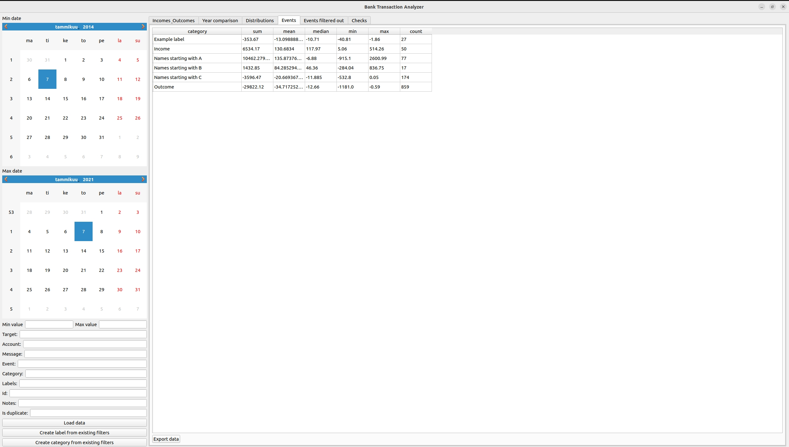

# Bank Transaction Analyzer

Bank Transaction Analyzer provides analysis and visualization of bank transaction data.

By default the analyzer works with Nordea internet bank data but can be customized to work with other data formats too.

## Before usage

* Install Python >= 3.6.
* Install requirements.
* Fill parameters to config.json.
* Write your own indicators if you like (see indicators.csv for example)


**Installation using virtualenv (Ubuntu)**

```
./install.sh
```

**Creating indicators**

Indicator is a thing you want to follow over time. It can be e.g. salary, traveling expenses, housing costs, sport expenses and so on. You can make your own indicator by creating new row in indicators.csv file (or any other file with same format). There, you specify name of indicator (str), min and max value (float) and regexp patterns (str) that define indicator. E.g. sale|prisma|citymarket|k market|s market|k supermarket|kylävalinta|lidl|siwa as target would group purchases from multiple stores, and this way you can follow "Store" indicator over time. Indicators can be loaded and used in Indicators tab. The creation of indicators can be assisted by GUI: select filters (sidebar on left) and see which events are filtered out (Events tab). When you are happy, just copy-paste filter values to indicators file.

## Usage

* Export your data from Nordea internet bank (Tilit / Tilitapahtumat ja tilin tiedot / Tapahtumaluettelo).
* Start GUI program from command line by typing ```python3 main.py [-- config config_path]``` or simply ```./run.sh [config_path]``` if you are using virtualenv with Ubuntu.
* Load data with load button which opens file dialog where you can choose multiple files for analysis.
* Set filter values and analyze you data by pressing Analyze data; this updates the figures.
* Change tabs to see different views and analyses for your data.

Note:
Some simulated test data is also provided (in test_data folder). This data can be used to test application.

## Screenshots (with simulated test data provided)

<p align="center">

</p>

<p align="center">

</p>

<p align="center">

</p>

<p align="center">

</p>

<p align="center">

</p>

<p align="center">

</p>

## Using application with non-default data format

By default the analyzer works with Nordea internet bank data, with certain data format. However, the application can be used with other data formats too. This is done by implementing custom Loader and Transformer class.

Loader loads the raw data from files. It needs to inherit and implement LoaderInterface class.

Transformer collects relevant information from raw data and converts it to specified format that can be handled by application. It needs to inherit and implement TransformerInterface class. Output of Transformer is validated. It needs to pass validation checks defined in data_processing/validation.py file:

```
schema = pandas_schema.Schema([
        Column('value', decimal_validation + nan_validation),
        Column('time', datetime_validation + nan_validation),
        Column('target', string_validation),
        Column('message', string_validation),
        Column('event', string_validation),
        Column('account_number', string_validation),
    ])
```

When custom Loader and Transformer classes are created, they can be used by adding bank option to data_processing/bank_selection.py file and selecting that bank in config.json file.


