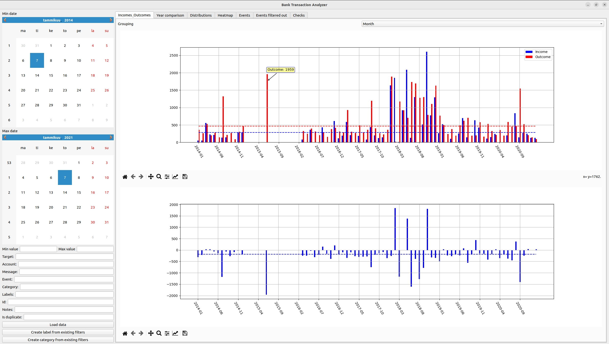
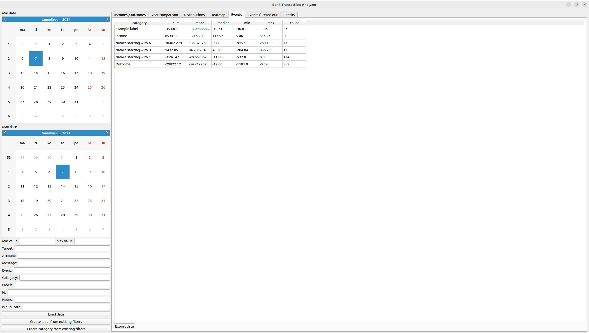
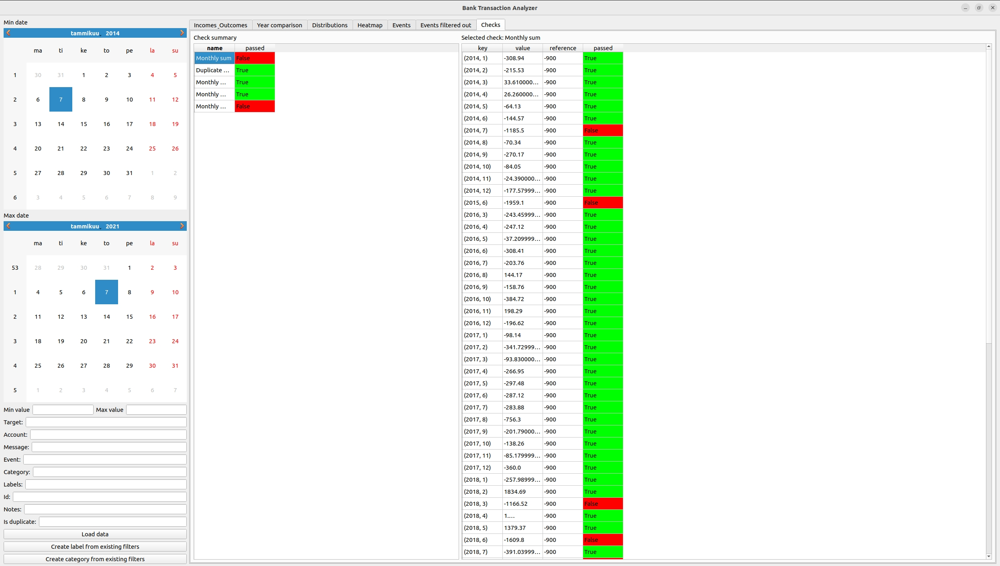

# Bank Transaction Analyzer

Bank Transaction Analyzer provides versatile and flexible analysis and visualization of bank transaction data.

By default, the analyzer works with Nordea internet bank data (both old and new format) but can be customized to work 
with other banks and data formats too. User-defined configuration is used to adapt analysis od the data. 

# Before usage

* Install Python >= 3.8.
* Install requirements.

For Ubuntu users there is installation script: ```./install.sh```.

# Basic usage

* Export your data from Nordea internet bank 
  * Old internet bank: Tilit / Tilitapahtumat ja tilin tiedot / Tapahtumaluettelo
  * New internet bank: Talous / tilit / Tapahtumat ja tiedot / CSV
* Start GUI program from command line by typing ```python3 main.py [-- config config_path]``` or simply 
```./run.sh [config_path]``` if you are using virtualenv with Ubuntu.
* Load data with load button which opens file dialog where you can choose multiple files for analysis.
* Set filter values and press Enter to apply filtering.
* Change tabs to see different views and analyses for your filtered data.

**Events**
* Events tab table can be sorted (left click) or grouped (right click) by any column by clicking corresponding column name.
* Add free form notes to events in Events tab; these are saved automatically.

**Checks**
* Left click check name to see more detailed check results in table format.  

Note:
Some simulated test data is also provided (in test_data folder). This data can be used to test application.

# Configuration

Config file is used for app configuration. It contains

* General configs
* Drop data
* Categories
* Labels
* Checks
* Notes

You can make your own configurations by creating a file with same format as in config.json example file or just by 
directly modifying it.

**Drop data**

Drop data specifies which items should be always filtered out. E.g. "target": ["Liisa", "Mikko"] would filter out all 
the rows where target is Liisa or Mikko. You can add new items to drop data by modifying config file directly or from 
Events tab by right clicking event you want to add to drop_data list.

**Categories**

Events are classified to different categories.  E.g. one could create category "Transport expenses" by selecting 
"target" as "vr|taksi|abc|teboil|neste" and "max_value" as 0. Every event can have only one category.

You can make your own category by creating new item in config file or by selecting suitable filter values from GUI and 
pressing "Create category from existing filters" button. If an event matches to multiple categories, then the 
last category in the file will be used as the category of event.

**Labels**

Labels work like categories with the difference that event can have multiple labels.

You can make your own label by creating new item in config file or by selecting suitable filter values from GUI and 
pressing "Create label from existing filters" button.

**Checks**

Checks can be used to create automate checks for your data.

You can make a check by creating new item in config file. Every check needs type (class name) and arguments. All the 
possible check types are listed in file src/data_processing/checks/checks.py.

**Notes**

Notes contains free notes for events. The notes will be saved to config file automatically based on notes user has 
added in tabs "Events" and "Events filtered out". The content of the file will be loaded when app launches and all the 
existing notes are shown in GUI.

# Screenshots (with simulated test data provided)

<p align="center">

</p>

<p align="center">

</p>

<p align="center">

</p>

<p align="center">

</p>

<p align="center">

</p>

<p align="center">

</p>

# Advanced

## Using application with non-default data format

By default the analyzer works with Nordea internet bank data, with certain data format. However, the application can be 
used with other data formats too. This is done by implementing custom Loader and Transformer class.

Loader loads the raw data from files. It needs to inherit and implement LoaderInterface class.

Transformer collects relevant information from raw data and converts it to specified format that can be handled by 
application. It needs to inherit and implement TransformerInterface class. Output of Transformer is validated. It needs 
to pass validation checks defined in src/data_processing/validation.py file:

```
schema = pandas_schema.Schema([
        Column('value', decimal_validation + nan_validation),
        Column('time', datetime_validation + nan_validation),
        Column('bank', string_validation + nan_validation),
        Column('target', string_validation),
        Column('message', string_validation),
        Column('event', string_validation),
        Column('account_number', string_validation),
    ])
```

When custom Loader and Transformer classes are created, they can be used by adding bank to DataPreprocessor class
(src/data_processing/data_preprocessing.py).

## Custom checks

All the check types are listed in /src/data_processing/checks/checks.py. New check type can be added just by 
implementing a new class in this file. Note that any check needs to inherit and implement Check which is interface for 
checks. After the class is created, it can be used via configuration by setting type field as class name.   

## Docker

Grant the Docker container access to the host system's X server, needed by QT.
```xhost +local:docker```

Then use docker commands to build image and run container. You can also use docker-compose file and simply run
```docker-compose up```

Note that volume mappings should be modified to map your own config file and data to container.


