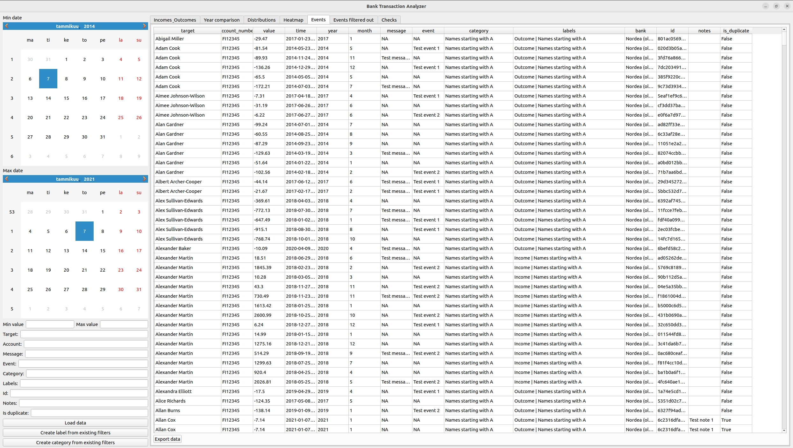

# Account Analyzer
Account Analyzer provides analysis and visualization of Nordea internet bank data. 

## Before usage

* Install Python >= 3.6.
* Install requirements.
* Fill parameters to config.py.
* Write your own indicators if you like (see indicators.csv for example)

## Usage

* Export your data from Nordea internet bank (Tilit / Tilitapahtumat ja tilin tiedot / Tapahtumaluettelo).
* Start GUI program from command line by typing python main.py.
* Load data with load button which opens file dialog where you can choose multiple files for analysis.
* Set filter values and analyze you data by pressing Analyze data; this updates the figures.
* Change tabs to see different views and analyses for your data.

Note:
Some simulated test data is also provided (in test_data folder). This data can be used to test application.

## Screenshots (with simulated test data provided)

